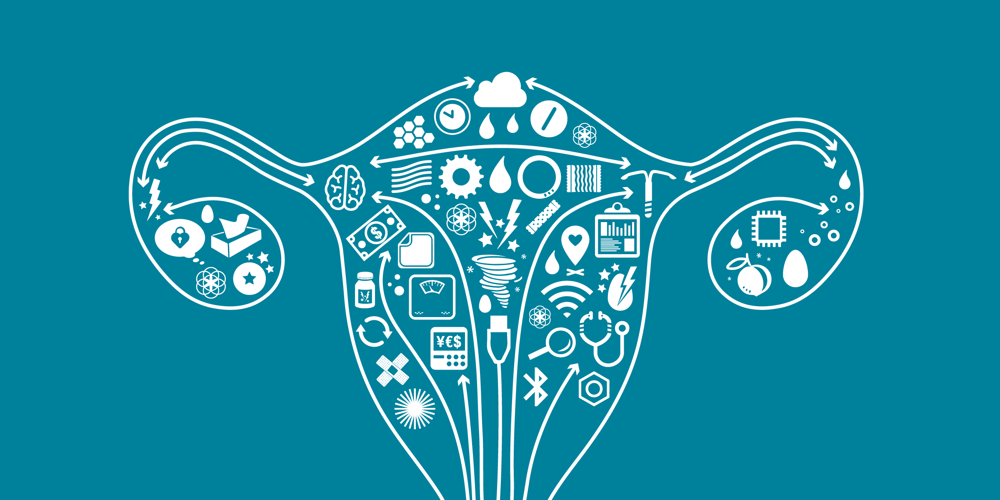
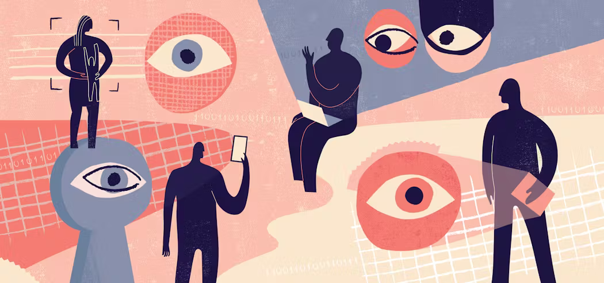
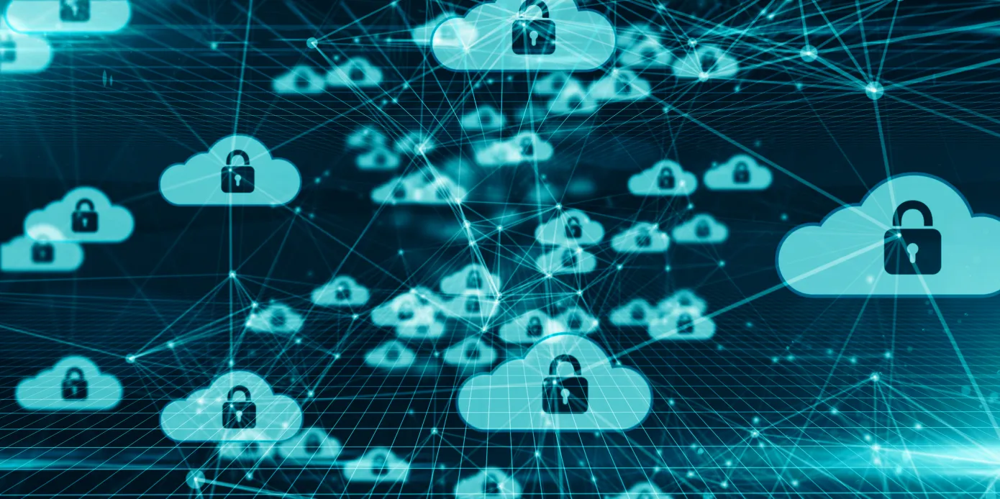
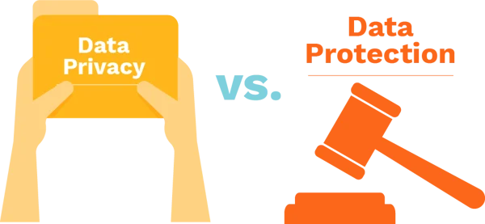

ENGL-BC1023 

DATA PRIVACY IN FEMTECH 

 
(The Rise of a New Category)

Summer B, 2023 | TR 9am-12pm ET

---

# Table of Contents
- [Table of Contents](#table-of-contents)
  - [Course Description ](#course-description-)
    - [Learning Objectives ](#learning-objectives-)
    - [Assignments ](#assignments-)
  - [Weekly Schedule ](#weekly-schedule-)
    - [Week 1 ](#week-1-)
      - [Data Usage ](#data-usage-)
      - [Data Privacy ](#data-privacy-)
    - [Week 2 ](#week-2-)
      - [Data Security ](#data-security-)
      - [Data Protection ](#data-protection-)
- [Image Citations](#image-citations)

## Course Description 

The era of "big data" has transformed the commodification of a user's data. Coupled with the rise of "FemTech" mobile apps, big data has provided new insights and access for women around the world. However, the commodification and exploitation of data has created a new set of risks. This course will examine how data is used, dissemenated, secured, and protected. Course material will focus on data with respect to reproductive technology apps

### Learning Objectives 

In this two week course you will learn:

- How reproductive technology apps (or FemTech) capture and utilize data
- How data is packaged and sold
- How law enforcement is accessing and using this data in a post Roe era
- How data is targetted and stolen by criminals and state actors
- How to regain control over your data and explore frameworks for protecting users and their data

### Assignments 

Each day will include a number of required readings followed by a short discussion post on courseworks. You are expected to come to class prepared to analyze and discuss each reading. In class participation accounts for 60% of your grade in this two week module.

**Extra Credit**

At the end of the course, you may choose to review one or several apps running on your mobile device. In a brief summary (no more than 2 pages), analyze your findings. What data was being tracked? Was that data shared with other applications? What implications could arise from that sharing? Read the terms of use for the application. Does it include any information on how data is stored or shared with 3rd-party vendors? Does this present a risk?

## Weekly Schedule 

### Week 1 

#### Data Usage 

 
(Wie Big Data Ihre IoT-Lösung beeinflusst)

**Readings:**

* French, Alice, et al. “Asia’s Femtech Revolution: The Quest for Better Women’s Health.” FT.Com, Mar. 2022. ProQuest, https://www.proquest.com/docview/2647606425/citation/BB07F33C3A7B4FE1PQ/1
* Karlsson, Amanda. “A Room of One’s Own?: Using Period Trackers to Escape Menstrual Stigma.” Nordicom Review, vol. 40, no. s1, 2019, pp. 111–23. ProQuest, https://doi.org/10.2478/nor-2019-0017
* The Rise of a New Category: Femtech. helloclue.com, https://helloclue.com/articles/culture/rise-new-category-femtech. Accessed 6 Aug. 2023.

**Learning goals:**

* Analyze the role these apps play in providing services for women globally. 
* How might they be providing education or choice to women in regions where menstruation is taboo? 
* How, if at all, does this technology facilitate safety or access?
* What types of data might be sensitive?
* Ultimately, I want you to come away from this with a sense of the benefits of data collection and how that data can be used to empower women. 

#### Data Privacy 

 
(Gilbert)

**Readings:**

* Scatterday, Allysan. “This Is No Ovary-Action: Femtech Apps Need Stronger Regulations to Protect Data and Advance Public Health Goals.” North Carolina Journal of Law & Technology, vol. 23, no. 3, 2022 2021, pp. 636–68.
* Cox, Joseph. “Data Broker Is Selling Location Data of People Who Visit Abortion Clinics.” Vice, 3 May 2022, https://www.vice.com/en/article/m7vzjb/location-data-abortion-clinics-safegraph-planned-parenthood.
* Translated by Content Engine, L. L. C. "Lack of data protection in the U.S. facilitates abortion prosecution." CE Noticias Financieras, Aug 17, 2022. ProQuest, http://ezproxy.cul.columbia.edu/login?url=https://www.proquest.com/wire-feeds/lack-data-protection-u-s-facilitates-abortion/docview/2703849612/se-2
* Tangalakis-Lippert, Katherine. "Facebook and Google are handing over user data to help police prosecute abortion seekers." Business Insider, Mar 05, 2023. ProQuest, http://ezproxy.cul.columbia.edu/login?url=https://www.proquest.com/newspapers/facebook-google-are-handing-over-user-data-help/docview/2782548340/se-2

**Learning goals:**

* How is data treated as a commodity to be sold and who might be buying that data?
* How could law enforcement misuse or abuse data gained from resellers? What are the implications when a warrant is no longer needed? 
* What implications does this have for FemTech applications? Does this reduce their effective benefits to women globally?
* How might data sharing among applications present a risk to women in a post Roe era?
* How can location data be misused by law enforcement to prosecute women - even those who didn't have abortions? What potential does this have to impact minority or working class women?
* While this is only a small subset of "Data Privacy" you should come away from this with a better understanding of the types of data collected, how it's used/sold, and the potential risks behind collection of that data.

### Week 2 

#### Data Security 

 
(Lunden)

**Readings:**

* For 2nd Time in 3 Years, Mobile Spyware Maker MSpy Leaks Millions of Sensitive Records – Krebs on Security. 4 Sept. 2018, https://krebsonsecurity.com/2018/09/for-2nd-time-in-3-years-mobile-spyware-maker-mspy-leaks-millions-of-sensitive-records/
* “Major” Data Breaches from Insecure Mobile Apps Likely Document Gale General OneFile. https://go.gale.com/ps/i.do?p=ITOF&u=columbiau&id=GALEA275440957&v=2.1&it=r&sid=summon. Accessed 6 Aug. 2023
* Sen. Franken Presses Federal Officials to Crack Down on “Stalking Apps” in Wake of MSpy App Data Breach Document Gale OneFile: News. https://go.gale.com/ps/i.do?p=STND&u=columbiau&id=GALEA414291300&v=2.1&it=r&sid=summon. Accessed 6 Aug. 2023
* **OPTIONAL** Under Armour Announces Data Breach, Affecting 150 Million MyFitnessPal App Accounts Document Gale In Context: Opposing Viewpoints. https://go.gale.com/ps/i.do?p=OVIC&u=columbiau&id=GALEA532777187&v=2.1&it=r&sid=summon. Accessed 6 Aug. 2023
* **OPTIONAL** The Great Fish Tank Hack. https://cyberhound.com/the-great-fish-tank-hack/. Accessed 6 Aug. 2023.

**Learning goals:**

* Given the rise of cyberattacks targetting data, what are the risks of collecting data even when data isn't sold or given to 3rd-parties?
* What are some reasons that criminals or nation states might target data from FemTech applications?
* What incentives do companies have (if any) to secure your data? Are the current fines or regulations adequate in detering irresponsible data security policies?
* This is just a surface level introduction to cybersecurity and data security but you should ultimately have a better understanding of how data can be misused even when it's not being commoditized. 

#### Data Protection 

 
(Buhrkuhl)

**Readings:**

* Gerl, Armin, et al. “Let Users Control Their Data – Privacy Policy-Based User Interface Design.” Human Interaction and Emerging Technologies, edited by Tareq Ahram et al., Springer International Publishing, 2020, pp. 790–95. Springer Link, https://doi.org/10.1007/978-3-030-25629-6_123
* “Bellabeat Is First Period and Pregnancy Tracking App and Wearable to Implement Private Key Encryption (AES-256) Security Feature to Protect Women’s Data in the Wake of Roe Vs. Wade Overturn.” U.S. Newswire, 18 Aug. 2022. ProQuest, https://www.proquest.com/docview/2703559588/citation/E9661CF1A16F41D8PQ/1
* A NEW COMPACT FOR SEXUAL PRIVACY. Document Gale OneFile: LegalTrac. https://go.gale.com/ps/i.do?p=LT&u=columbiau&id=GALEA666682274&v=2.1&it=r&sid=summon. Accessed 6 Aug. 2023

# Image Citations
Gilbert, Arlo. “What We Can Learn about Data Privacy from Big Tech’s Mistakes.” Security Info Watch, 20 July 2023, https://www.securityinfowatch.com/cybersecurity/article/53066756/what-we-can-learn-about-data-privacy-from-big-techs-mistakes.

Buhrkuhl, Curtis. What’s The Difference Between Privacy and Data Protection? https://www.office1.com/blog/whats-the-difference-between-privacy-and-data-protection. Accessed 6 Aug. 2023.

Lunden, Ingrid. “Dig Scoops up $34M to Tackle the Fragmented World of Cloud Data Security.” TechCrunch, 14 Sept. 2022, https://techcrunch.com/2022/09/14/dig-scoops-up-34m-to-tackle-the-fragmented-world-of-cloud-data-security/.

Wie Big Data Ihre IoT-Lösung beeinflusst. 25 July 2018, https://www.scnsoft.de/blog/big-data-im-iot-besonderheiten.

The Rise of a New Category: Femtech. helloclue.com, https://helloclue.com/articles/culture/rise-new-category-femtech. Accessed 6 Aug. 2023.

